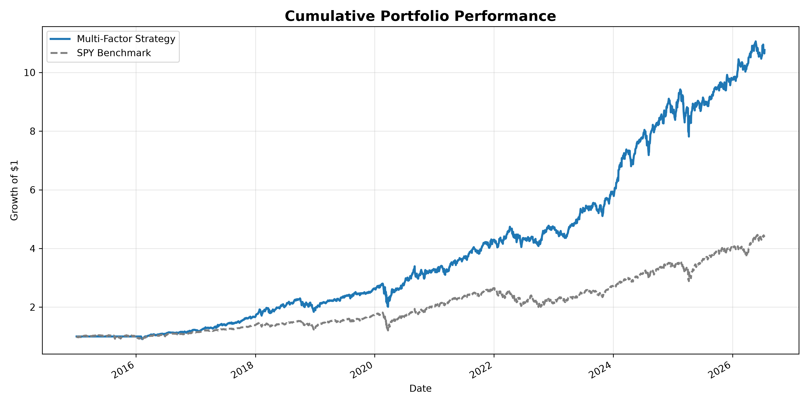
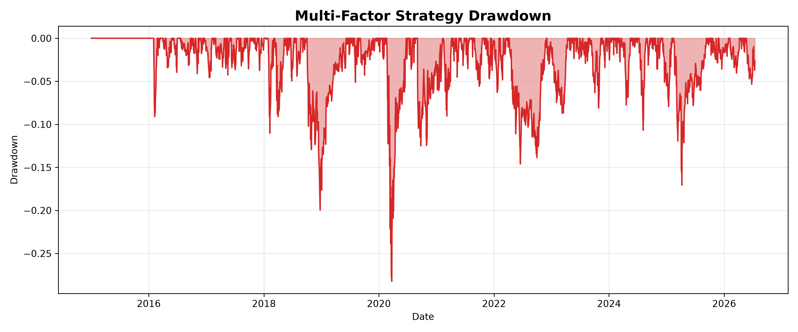
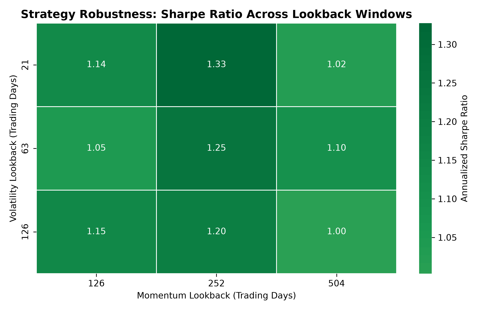

# Multi-Factor Portfolio Backtesting

[](https://github.com/Justus-Philippsen/multi-factor-portfolio-backtesting/actions/workflows/ci.yml)

A systematic U.S. equity research project that constructs, backtests, and attributes a monthly rebalanced momentum and low-volatility portfolio against the SPY benchmark.

> **Research use only:** This project is educational and does not constitute investment advice. Historical backtests do not predict future performance.

## Research Question

Can a transparent, rules-based portfolio that combines cross-sectional momentum and low-volatility signals deliver risk-adjusted performance beyond a broad U.S. equity benchmark?

## Strategy Design

| Component | Implementation |
|---|---|
| Universe | 30 large-cap U.S. equities |
| Benchmark | SPY ETF |
| Sample start | January 2015 |
| Momentum signal | Trailing 252-trading-day price return |
| Low-volatility signal | Inverse trailing 63-trading-day annualized volatility |
| Signal blend | 60% momentum, 40% low volatility |
| Selection | Top 30% by composite cross-sectional score |
| Portfolio | Equal-weighted selected stocks |
| Rebalancing | Monthly, at month-end |
| Execution assumption | One-trading-day implementation lag |
| Transaction costs | 10 basis points per unit of turnover |
| Data | Split- and dividend-adjusted daily prices via `yfinance` |

## Workflow

1. Download adjusted daily prices for the equity universe and SPY.
2. Calculate momentum and low-volatility signals for each stock.
3. Convert raw signals to cross-sectional percentile ranks.
4. Combine ranks into a 60/40 composite score.
5. Select the top 30% of valid securities and assign equal weights.
6. Apply a one-day lag, calculate turnover, and deduct transaction costs.
7. Compare cumulative and risk-adjusted performance with SPY.
8. Regress monthly strategy excess returns on Fama-French five factors.

## Results

### Cumulative Performance



### Strategy Drawdown



## Robustness Check

The sensitivity analysis evaluates 81 parameter combinations across momentum lookback windows, volatility lookback windows, portfolio breadth, and transaction-cost assumptions. The heatmap isolates the base portfolio setting of 30% breadth and 10 basis points of transaction costs.



- [Full sensitivity-analysis results](outputs/sensitivity_analysis.csv)

## Factor Attribution

The project estimates a monthly Fama-French five-factor regression with heteroskedasticity-consistent HC3 standard errors:

\[
R_{\text{strategy},t} - R_{f,t} =
\alpha + \beta_M(MKT-RF)_t + \beta_S SMB_t + \beta_H HML_t + \beta_R RMW_t + \beta_C CMA_t + \epsilon_t
\]

The output includes alpha, factor loadings, t-statistics, p-values, \(R^2\), and the number of observations. The five-factor model includes market, size, value, profitability, and investment factors. [Kenneth R. French Data Library](https://mba.tuck.dartmouth.edu/pages/faculty/ken.french/data_library.html)

- [Performance metrics](outputs/performance_metrics.csv)
- [Fama-French regression output](outputs/factor_regression.csv)

## Project Structure

```text
multi-factor-portfolio-backtesting/
├── .github/workflows/
│   ├── ci.yml                       # Automated syntax checks and tests
│   └── weekly_backtest.yml           # Scheduled backtest and artifacts
├── data/
│   ├── raw/                          # Local data cache, excluded from Git
│   └── processed/                    # Local processed data, excluded from Git
├── outputs/
│   ├── cumulative_performance.png
│   ├── strategy_drawdown.png
│   ├── performance_metrics.csv
│   └── factor_regression.csv
├── src/
│   ├── data_loader.py
│   ├── factor_regression.py
│   ├── factors.py
│   ├── performance.py
│   ├── portfolio.py
│   └── visualization.py
├── tests/
│   └── test_portfolio.py
├── run_backtest.py
├── pytest.ini
└── requirements.txt
```

## Installation

```bash
git clone https://github.com/Justus-Philippsen/multi-factor-portfolio-backtesting.git
cd multi-factor-portfolio-backtesting
python -m pip install -r requirements.txt
```

## Usage

Run the full local pipeline:

```bash
python run_backtest.py
```

Generated files are saved in `outputs/`. The first run downloads historical prices; subsequent runs use the local cache in `data/raw/`.

Run automated tests:

```bash
python -m pytest
```

To force a fresh local market-data download, delete the cached price file before running the backtest:

```bash
del data\raw\adjusted_close_prices.csv
python run_backtest.py
```

## Automation

- **Python CI:** Runs syntax validation and the test suite on every push and pull request to `main`.
- **Weekly Market Data Backtest:** Runs every Monday at 08:00 Europe/Berlin time and can be started manually from the GitHub **Actions** tab.
- **Artifacts:** Each scheduled run uploads current CSV outputs and charts as a downloadable `weekly-backtest-results` artifact.

## Limitations

- The fixed 30-stock universe creates survivorship bias and does not represent a point-in-time investable universe.
- `yfinance` is a convenient public data source, not an institutional data feed.
- The implementation does not model bid-ask spreads, market impact, taxes, borrow costs, or liquidity constraints.
- Factor regression is descriptive, not proof of causal alpha.
- Results are sensitive to the chosen sample, signals, rebalancing rule, and cost assumptions.

## Future Research

- Replace the fixed universe with a point-in-time constituent dataset.
- Add a fundamental quality factor using profitability and balance-sheet data.
- Conduct walk-forward and subperiod robustness tests.
- Evaluate sensitivity to transaction costs, lookback windows, portfolio breadth, and rebalance frequency.
- Add a benchmark-relative attribution report and additional risk measures.

## License

This project is licensed under the MIT License. See [LICENSE](LICENSE) for details.